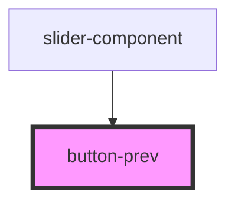

# button-prev

<!-- Auto Generated Below -->

## Events

| Event       | Description | Type                |
| ----------- | ----------- | ------------------- |
| `prevSlide` |             | `CustomEvent<void>` |

## Dependencies

### Used by

 - [slider-component](../slider-component)

### Graph

----------------------------------------------

*Built with [StencilJS](https://stenciljs.com/)*
