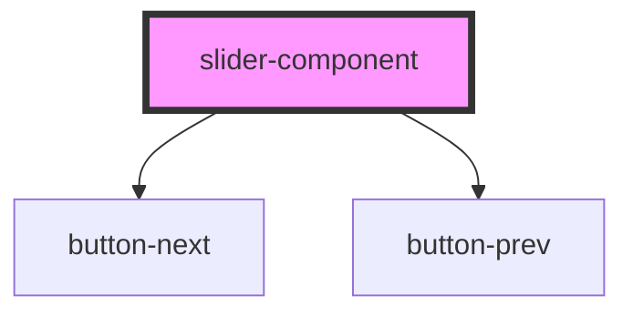

# slider-component

<!-- Auto Generated Below -->

## Properties

| Property     | Attribute     | Description | Type      | Default |
| ------------ | ------------- | ----------- | --------- | ------- |
| `showStatus` | `show-status` |             | `boolean` | `false` |

## Dependencies

### Depends on

- [button-next](../button-next)
- [button-prev](../button-prev)

### Graph

----------------------------------------------

*Built with [StencilJS](https://stenciljs.com/)*
